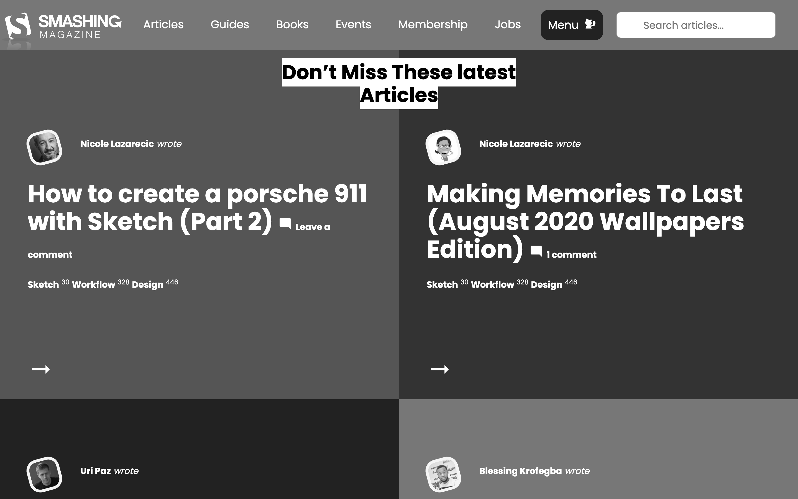

# Smashing Magazine Clone

> A clone of the Smashing Magazine website landing.

The aim of this project was to clone the current [Smashing Magazine](https://www.smashingmagazine.com/) landing page with focus on the UX of the website.

Cloning the website with a focus on UX was done by playing with the different colors on the website with varying degrees of the gray color.

The sections highlighted in this clone are:

- Page navigation
- Featured latest articles
- Latest posts
- Different types of Ads
- Person of the week
- Selected authors
- Smashing Magazine Guides
- Newsletter subscription box
- Footer containing several topics

## Built With

- HTML,
- CSS3

## Live Demo

[Live Demo Link](https://raw.githack.com/ggotora/smashing-mag-clone/ux-feature/index.html)

## Authors

👤 **Author1**

- Github: 

👤 **Author2**

- Github: 

## 🤝 Contributing

Contributions, issues and feature requests are welcome!

Feel free to check the [issues page](issues/).

## Show your support

Give a ⭐️ if you like this project!

## 📝 License

This project is [MIT](lic.url) licensed.
